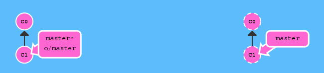

# Collaboration et suivi des développements

## Objectifs

- Travailler à plusieurs sur un même code
- Pouvoir suivre les modifications effectuées au cours du temps

## Outils de gestion de version (Version Control Systems) et leur histoire

- **RCS** (1982) : permettait à un utilisateur de suivre les évolutions sur un fichier
- **CVS** (1990) : gestion de plusieurs fichiers, indépendamment, et centralisation sur un serveur réseau collaboratif
- **Subversion** (2000) : gestion "groupée" des fichiers, suivi de l'historique
- **Git** (2005) : gestion décentralisée

## Git : Installation

[Téléchargement](http://git-scm.com/downloads) pour Windows / Mac / Linux

## Git : Fonctionnement

Il faut voir Git comme :
- un moyen de sauvegarder l'**état** d'un projet
- un moyen d'intégrer facilement les **modifications** faites par autrui

### État d'un projet et commit

Le coeur de Git est donc l'historique des états, qu'on peut symboliser par ces petites "bulles" qu'on appel habituellement des *commits*

À un *commit* correspond l'état de l'ensemble des fichiers d'un projet à un instant donné.

Par exemple, au départ de notre projet, on pourrait avoir l'état C0 suivant :

    exemple/
    |-- [ 1.4k Nov 23 17:59]  file_1.py
    `-- [  458 Nov 23 17:59]  file_2.py

On décide ensuite d'ajouter un fichier file_3.py puis de faire un *commit* pour sauvegarder l'état de notre projet après cet ajout. On aurait alors un état C1 comme-ci :

    exemple/
    |-- [ 1.4k Nov 23 17:59]  file_1.py
    |-- [  458 Nov 23 17:59]  file_2.py
    `-- [ 5.1k Nov 23 18:06]  file_3.py

On effectue ensuite quelques modifications dans le fichier file_1.py et on les *commit* à leur tour dans un état C2 :

    exemple/
    |-- [ 1.5k Nov 23 18:27]  file_1.py
    |-- [  458 Nov 23 17:59]  file_2.py
    `-- [ 5.1k Nov 23 18:06]  file_3.py

Il est important de se rappeler qu'avec un outil comme Git, on manipule des "états" de notre projet et non pas les fichiers eux-même, comme affiché dans les extraits ci-dessus.

La commande pour sauvegarder l'état d'un projet est :
    
    $ git commit

[Exemple par la pratique #1 : Premier commit](http://pcottle.github.io/learnGitBranching/?NODEMO)

En pratique, on définit également un "message" avec le *commit* pour exliquer les changements qui ont eu lieu. La commande `git commit` ouvrira un éditeur de texte pour vous demander ce message.

Vous pouvez aussi le préciser directement avec :

    $ git commit -m 'Ajout du fichier file_3.py'

### Informations sur l'espace de travail

Pour s'y retrouver facilement, il est important de connaitre quelques commandes permettant de demander à Git des informations sur l'état courant, les états précédents, etc.

Commençons par la commande décrivant l'état courant :

    $ git status
    Sur la branche master
    Votre branche est à jour avec 'origin/master'.

    Modifications qui seront validées :
      (utilisez "git reset HEAD <fichier>..." pour désindexer)

        modified:   ../file_1.py

    Fichiers non suivis:
      (utilisez "git add <fichier>..." pour inclure dans ce qui sera validé)

        ../file_draft.py

Les commandes de git sont souvent très informatives, car en plus de faire le job qu'on leur demande, elles donnent également de nombreux conseils sur les commandes qu'on pourrait vouloir taper ensuite.

Ici, on apprend par exemple :

- Que le fichier file_1.py a été modifié et que ces modifications seront sauvegardées dans l'état si l'on fait un *commit*.
- Qu'on peut éviter cette sauvegarde en executant la commande `git reset HEAD file_1.py`
- Qu'on a un fichier file_draft.py qui a été modifié ou créé et que lui ne sera pas sauvegardé en faisant un commit.
- Qu'on peut l'ajouter aux fichiers dont l'état sera sauvegardé en tapant la commande `git add file_draft.py`

Une autre information utile concerne également l'historique des états précédents :

    $ git log
    commit 888a8b4c28b229fa22fe72400c1bac37bbf9eaaa
    Author: Florian B <f.b@example.com>
    Date:   Mon Nov 10 11:51:37 2014 +0100

        Add file_3.py

    commit a892a269442de2f1ff26c48a1cc173a82377f400
    Author: Florian B <f.b@example.com>
    Date:   Mon Nov 10 11:51:19 2014 +0100

        Initial commit : add file_1.py and file_2.py

On peut visionner ça d'une façon un peu plus concise avec :

    $ git log --graph --decorate --oneline
    * 888a8b4 (HEAD, master) Add file_3.py
    * a892a26 Initial commit : add file_1.py and file_2.py

### Naviguer dans Git

HEAD, master : kesako ?

Tout l'avantage d'un système comme Git, c'est non seulement de pouvoir sauvegarder l'état d'un projet au fur et à mesure qu'on travail dessus, mais aussi de pouvoir replonger dans le passé instantanément.

Et pour ainsi naviguer dans le temps et l'espace, il est assez prtique de savoir où on se trouve !

HEAD, c'est justement notre position. Quand on modifie des fichiers puis qu'on fait un *commit*, le nouvel état est ajouté à la suite de la position HEAD.

Et comment change-t-on de position ? Avec la commande suivante :

    $ git checkout C1

On remarque alors que si on rélise un *commit* depuis cette position, il ne va pas se placer proprement à la suite de l'historique, mais venir se placer à la suite de là où l'on se trouvait :

Master représente l'état sauvegardé le plus récent de notre projet, notre espace de travail principal.

On pourrait retourner à la position de master avec la commande :

    $ git checkout master

Puis refaire nos modifications, refaire notre *commit* et avoir bel et bien notre modifications venant s'enchainer proprement avec les précédentes.

Mais certaines commandes vont plus loin que la navigation dans l'historique, en permettant d'y effectuer des modifications.

### Modifications dans Git

Pour faire en sorte que notre état C3 ne soit plus branché sur C1, mais soit plutôt branché sur C2, notre *master*, on utilise la commande suivante :

    git rebase master C3

### Et la collaboration ?

Toutes les commandes réalisées précédemment agissaient sur votre espace de travail local, sur votre copie locale de l'historique.

C'est tout l'avantage d'un système décentralisé comme Git par rapport à son ancêtre Subversion : on peut faire nos développements dans notre coin, étape par étape, en réalisant régulièrement des *commits* de notre travail, puis mettre en commun qu'utérieurement, quand le code et l'historique sont prêt à être partagés.

Mais alors, comment fait-on ?

En copiant un espace de travail sur un serveur pour que plusieurs personnes y accèdent, on peut alors passer en mode collaboratif.

### Récupération d'un espace distant

La commande permettant de récupérer un espace mis en ligne sur un serveur est la commande `git clone` suivi du nom du serveur :

    $ git clone git@github.com:HackYourPhd/open_geek_atelier_3.git

[Exemple par la pratique #2 : Collaboration](http://pcottle.github.io/learnGitBranching/?NODEMO)

Qu'est ce que tout ce bazar ? Pourquoi a-t-on ces doublons : master et o/master (plus souvent : origin/master) ?

Simplement parce que maintenant, on est plus tout seul : Git nous indique la position de notre espace local principal *master* mais aussi la position de l'espace principal sur le serveur, qui peut évoluer si des collaborateurs effectuent des travaux de leurs côtés.

### Mise à jour d'un *repository*

Imaginons que d'autres ont fait des modifications, enregistrés dans deux commits, qu'ils ont mit en commun sur le serveur:

    $ git fakeTeamwork
    $ git fakeTeamwork

On constate que nous ne sommes plus du tout synchronisé avec le serveur. Pour récupérer ce qu'on pu réaliser nos collaborateurs, on execute deux commandes :

- `git fetch` permet de télécharger tous les états que vous n'avez pas encore récupéré, mais sans toucher à votre espace de travail local. C'est un peu comme si on demandait à Git d'aller se renseigner pour savoir si d'autres ont ait des modifications, des développements, des évolutions.
- `git rebase origin` permet de se déplacer, avec tous les commits qu'on a pu effectuer en local depuis la dernière mise à jour à la suite

### Mise en commun de notre travail

Le travail réalisé en local nous satisfait et nous souhaitons le partager, l'intégrer au serveur commun. Rien de plus simple :

    $ git push origin master

## GitHub

C'est bien beau tout ça, mais comment on met en place un serveur, pour travailler réellement à plusieurs sur des vrais fichiers plutôt que des petites bulles roses ?

Et bien avec GitHub.

GitHub est un service sur internet qui permet d'héberger facilement des espaces de travail, sans avoir besoin d'installer et configurer un serveur chez soi.

On peut accéder au code mis en ligne sur GitHub sans se créer de compte, mais travailler collaborativement sur cette plateforme nécessite d'en créer un. [Let's go !](https://github.com/)

### L'espace de travail

Rendons-nous sur l'espace de travail que nous allons utiliser dans la suite de cet atelier :

https://github.com/HackYourPhd/open_geek_atelier_3

Cet espace présente tout un tas de fonctionnalités qui sont des équivalents graphiques de ce qu'on peut faire avec Git dans le terminal.

Ainsi, on peut consulter les fichiers de l'état courant, regarder les modifications apportées entre deux états, regarer l'historique des *commits*, etc.

On y trouve également l'adresse de l'espace de travail commun : le *repository*.

### Récupération du *repository*

Pour récupérer le *repository*, comme vu précedemment, on le `clone`:

    $ git clone git@github.com:HackYourPhd/open_geek_atelier_3.git
    $ cd open_geek_atelier_3

Cette commande va alors créer un dossier en local, dans lequel vont se trouver les fichiers du *repository* ainsi qu'un dossier caché *.git* qui contient tout ce qui permet à Git de faire son boulot.

### Première modifications

Créons chacun un fichier avec un nom un peu original et mettons-y un peu de contenu. Après l'avoir sauvegardé, observons le status de notre environnement de travail local :

    $ git status
    Sur la branche master
    Votre branche est à jour avec 'origin/master'.

    Fichiers non suivis:
      (utilisez "git add <fichier>..." pour inclure dans ce qui sera validé)

        renard_et_bouc.md

    aucune modification ajoutée à la validation mais des fichiers non suivis sont présents (utilisez "git add" pour les suivre)

Notre fichier est pour l'instant ignoré par Git, il faut lui demander le le suivre pour pouvoir l'inclure dans un commit :

    $ git add renard_et_bouc.md
    $ git status
    Sur la branche master
    Votre branche est à jour avec 'origin/master'.

    Modifications qui seront validées :
      (utilisez "git reset HEAD <fichier>..." pour désindexer)

        new file:   renard_et_bouc.md

Il est temps de sauver cet état de notre repository :

    $ git commit -m 'Ajout de la fable "Le renard et le bouc"'
    [master 543f1d1] Ajout de la fable "Le renard et le bouc"
    1 file changed, 33 insertions(+)
    create mode 100644 renard_et_bouc.md

On constate qu'un commit a été créé et nommé '543f1d1'. C'est un peu imprononcable, mais ça a le mérite d'être unique et d'ainsi permettre de référencer rapidement n'importe quel état en quelques lettres.

Si on observe alors le status de notre espace de travail :

    $ git status
    Sur la branche master
    Votre branche est en avance sur 'origin/master' de 1 commit.
      (utilisez "git push" pour publier vos commits locaux)

    rien à valider, la copie de travail est propre

Git nous préviens que nous n'avons plus aucune modification non enregistrée dans un *commit*, mais que nous avons un *commit* non publié sur le serveur.

### Synchronisation avec le serveur

Avant d'envoyer nos *commits* sur le serveur, il est de bon ton de vérifier si des gens n'y ont pas apporté leurs propres modifications.

Pour cela, on procède à une mise à jour, comme précédemment :

    $ git fetch
    $ git rebase origin/master

### Envoi des commits locaux

Comme précedemment, la commande est alors assez simple :

    $ git push origin master

### Et les conflits ?

Jusque là, tout s'est bien passé, car on a chacun travaillé de noter côté, sur des fichiers différents : Git n'a alors aucun problème a mélanger nos différentes modifications pour obtenir un état commun mélangeant tout ça.

Mais si l'on commence à  travailler sur les mêmes fichiers ? Là, Git ne sait plus tout faire tout seul, il va avoir besoin de notre aide !

Effectuez quelques modifications dans le fichiez que vous aviez créé plus tôt.
Faites un *commit* de cette modification et tentez de le partager comme on a fait plus tôt.

Qu'observez-vous ?

    $ git status
    Sur la branche master
    Votre branche est à jour avec 'origin/master'.

    Modifications qui ne seront pas validées :
      (utilisez "git add <fichier>..." pour mettre à jour ce qui sera validé)
      (utilisez "git checkout -- <fichier>..." pour annuler les modifications dans la copie de travail)

        modified:   renard_et_bouc.md

    aucune modification n'a été ajoutée à la validation (utilisez "git add" ou "git commit -a")

    $ git commit -a -m 'Quelques modifications sur le renard et bouc'
    [master aea0a31] Quelques modifications sur le renard et bouc
     1 file changed, 8 insertions(+)
    
    $ git push origin master
    To git@github.com:HackYourPhd/open_geek_atelier_3.git
     ! [rejected]        master -> master (fetch first)
    error: impossible de pousser des références vers 'git@github.com:HackYourPhd/open_geek_atelier_3.git'
    astuce: Les mises à jour ont été rejetées car la branche distante contient du travail que vous n'avez pas en local. Ceci est généralement causé par un autre dépôt poussé vers la même référence. Vous pourriez intégrer d'abord les changements distants (par exemple 'git pull ...') avant de pousser à nouveau. Voir la 'Note à propos des avances rapides' dans 'git push --help' pour plus d'information.

Mais oui bien sûr, nous n'avons pas synchronisé ! On remarque au passage que Git nous suggère d'utiliser la commande `git pull`. Je vous conseille de plutôt utiliser les commandes présentées plus haut, qui permettent de garder un historique bien plus propre et lisible.

    $ git fetch
    remote: Counting objects: 3, done.
    remote: Compressing objects: 100% (1/1), done.
    remote: Total 3 (delta 2), reused 3 (delta 2)
    Unpacking objects: 100% (3/3), done.
    Depuis github.com:HackYourPhd/open_geek_atelier_3
       415ade7..42f4f17  master     -> origin/master

    $ git rebase origin/master 
    Premièrement, rembobinons head pour rejouer votre travail par-dessus...
    Application : Quelques modifications sur le renard et bouc
    Utilisation de l'information de l'index pour reconstruire un arbre de base...
    M   renard_et_bouc.md
    Retour à un patch de la base et fusion à 3 points...
    Fusion automatique de renard_et_bouc.md
    CONFLIT (contenu) : Conflit de fusion dans renard_et_bouc.md
    Échec d'intégration des modifications.
    Le patch a échoué à 0001 Quelques modifications sur le renard et bouc
    La copie du patch qui a échoué se trouve dans :
       /home/florian/Dev/hyphd_code_sessions/open_geek_atelier_3/.git/rebase-apply/patch

    Lorsque vous aurez résolu ce problème, lancez "git rebase --continue".
    Si vous préférez sauter ce patch, lancez "git rebase --skip" à la place.
    Pour extraire la branche d'origine et stopper le rebasage, lancez "git rebase --abort".

Patatra, notre premier conflit !
Git nous indique que lorsqu'il a tenté d'appliquer les modifications que vous aviez faites dans votre *commit* sur l'état du *repository* distant, des lignes avaient changés.

Il implore donc votre aide pour cela.

`git status` nous permet de connaître les fichiers affectés par un conflit :

    $ git status
    rebasage en cours ; sur 42f4f17
    Vous êtes en train de rebaser la branche 'master' sur '42f4f17'.
      (réglez les conflits puis lancez "git rebase --continue")
      (utilisez "git rebase --skip" pour sauter ce patch)
      (utilisez "git rebase --abort" pour extraire la branche d'origine)

    Chemins non fusionnés :
      (utilisez "git reset HEAD <fichier>..." pour désindexer)
      (utilisez "git add <fichier>..." pour marquer comme résolu)

        modifié des deux côtés :  renard_et_bouc.md

    aucune modification n'a été ajoutée à la validation (utilisez "git add" ou "git commit -a")

Si l'on ouvre le fichier concerné avec un editeur de texte, on va découvrir la syntaxe un peu étrange mettant en exergue les conflits :

    <<<<<<< HEAD
      1: # LE RENARD ET LE BOUC #
      2: 
      3: Capitaine Renard allait de compagnie
    =======
    # LE RENARD ET LE BOUC #

    *Jean de la Fontaine*

    Capitaine Renard allait de compagnie
    >>>>>>> Quelques modifications sur le renard et bouc

La première partie, entre "<<<" et "===" montre le fichier tel qu'il se trouve sur le serveur, et donc les modifications apportées par nos collaborateurs.

La deuxième partie, entre "===" et ">>>" montre les modifications que nous avons nous-même effectuées dans le *commit* nommé "Quelques modifications sur le renard et bouc" 

Pour résoudre le conflit, il faut remplacer toutes les parties entre "<<<" et ">>>" par une version "fusionnée" des deux textes.

      1: # LE RENARD ET LE BOUC #
      2: 
      3: *Jean de la Fontaine*
      4: 
      5: Capitaine Renard allait de compagnie

Une fois la résolution sauvegardée, on valide cela dans git avec la commande suivante :

    $ git add renard_et_bouc.md

Et on indique au `rebase` de continuer son chemin :

    $ git rebase --continue
    $ git status
    Sur la branche master
    Votre branche est en avance sur 'origin/master' de 1 commit.
      (utilisez "git push" pour publier vos commits locaux)

    rien à valider, la copie de travail est propre

On peut alors mettre notre commit sur le serveur :

    $ git push origin master

### Résolution de conflicts : outils

Des outils facilitent la vie pour la résolution de conflits. Ils peuvent être lançés avec la commande :

    $ git mergetool

Si vous n'avez aucun outil approprié installé, git vous suggèrera des noms d'outils

Conseil :
- Linux :
    + meld
- Mac OS :
    + ?
- Windows :
    + ?

BONUS TODO :
- Modifier le script python pou qu'il provoque des conflits moins compliqués
- Ajouter un screenshot de meld
- Proposer une analyse du code python du script pour introduire
    + la récupération facile de dépendances avec pip (et le fichier requirements.txt)
    + path.py pour s'amuser
    + un peu de code python, parce que c'est cool 
