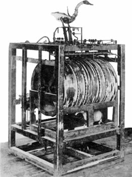
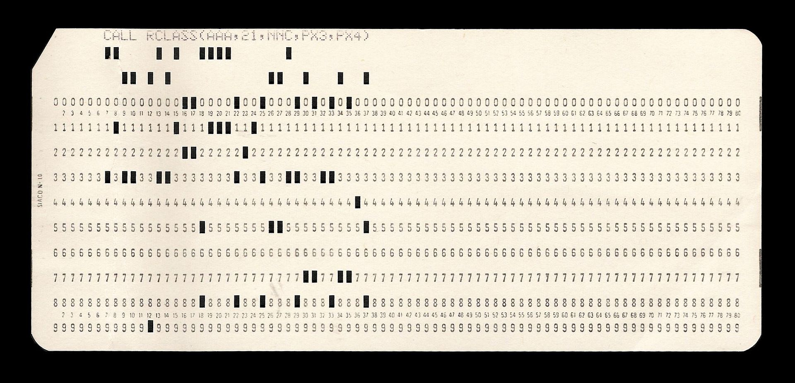

# Retour sur les Bases

## D'où vient votre Ordinateur

#### Automatiser des opérations
On est en tant qu'être human très mauvais pour répéter plein de fois une instruction sans faire d'erreur. Et on trouve ça très pénible  
Exemples :
 - faire plein d'additions à la main
 - recopier un livre
 - serrer de la même façon toute la journée les mêmes boulons

 

---

#### Les premiers automates

-87 : Machine d'Anticythère

1645 : la machine à calculer de Pascal

XVIIème siècle : la folie des automates

#### La naissance de l'informatique

#### Un peu de théorie

##### Les automates

États et transitions entre états.

##### [La machine de Turing](https://fr.wikipedia.org/wiki/Machine_de_Turing)
Objet théorique défini par [Alan Turing](https://fr.wikipedia.org/wiki/Alan_Turing)  
Le truc minimal qui permette d'implémenter n'importe quel programme.

##### Les machines à registres
Tout est expliqué par [Daniel Dennett](https://fr.wikipedia.org/wiki/Daniel_Dennett) [ici](http://sites.tufts.edu/rodrego/files/2011/03/Secrets-of-Computer-Power-Revealed-2008.pdf)

#### Les grands principes

##### Un système déterministe
L'informatique marche bien sur ce qui est régulier. Les exceptions seront toujours pénibles à gérer.

##### Un ensemble réduit d'instructions de bases

##### Compositionalité
Analogie : apprendre la musique  
Différents niveaux d'intégration co-existent

#### L'implémentation électronique

##### les grilles

##### transistors, semi-conducteurs et micro-électronique

#### actuellement

le **processeur** manipule des 0 et des 1 écrits en mémoire en suivant des instructions.

La **mémoire** de votre ordinateur :

 - la mémoire vive (l'information s'efface quand on coupe le courant)
 - le disque dur (l'information reste tant que pas modifiée)

## Communiquer avec un ordinateur

### Langages informatiques

Les **langages** informatiques permettent d'écrire des instructions de façon un peu moins pénible qu'avec des suites de 0 et de 1 :

 - Il fut un temps, ce n'était pas forcément mieux puisqu'il fallait
  
 (soyez heureux d'avoir un clavier au lieu d'une poinçonneuse !)
 - (explosion de langages pour des usages plus ou moins spécifiques)
 - Ceux que vous verrez dans ces ateliers :

   -  MarkDown
   -  [Python](https://www.python.org/)
   -  [R](http://cran.r-project.org/)

Pour un langage donné, l'interaction avec l'ordinateur se fera à un certain niveau d'intégration.  
Il faut choisir le langage en fonction du problème à résoudre.

Avantages de python :
  + conçu pour être (relativement) facile à lire et à écrire
  + open source
  + langage généraliste : on peut tout faire avec python
  + grosse communauté : plein de gens ont déjà fait plein de programmes en python qu'ils mettent à disposition de tous

### La ligne de commande
C'est l'interface privilégiée avec l'ordinateur quand on veut le soumettre à notre volonté.
Elle utilise un langage qui permet de communiquer avec l'ordinateur (de façon assez frustre, entendons-nous) c'est-à-dire d'envoyer des instructions à l'ordinateur en tapant directement la commande à effectuer et de voir l'output de ces instructions s'afficher à l'écran.

système|nom|pour ouvrir|langage
-------|--------|--------|------
windows|fenêtre de commande,... |win+R puis cmd| dos
mac|terminal,iterm,...|/Applications/Utilities/Terminal| bash
linux|terminal emulator,xterm,...|se loguer, ctrl+alt+t|bash, tcsh,...

`Ouvrez une fenêtre de commande. Quelles sont les informations affichées automatiquement?`

### La ligne de commande python

Plutôt que de travailler chacun avec un langage différent selon votre machine

### L'arborescence des fichiers
C'est une façon de se représenter et d'organiser l'information stockée sur le disque dur  
**Il vaut mieux toujours savoir où on est dans cette arborescence !**

**Concepts clef** :
- hierarchie : comme pour une adresse postale, afin d'indentifier quelqu'un à qui remettre un document, on part de l'échelle la plus haute et on spécifie un contenant particulier à chaque niveau d'organisation. Par exemple, on vous trouve sur terre, dans tel pays, dans telle ville, dans telle rue, dans tel bâtiment, dans telle pièce.
- **racine** : c'est le point de départ de l'organisation des informations (particularité de windows : il peut y en avoir plusieurs)
- **dossier** ou **repertoire** : c'est un contenant qui peut contenir des fichiers ou d'autres répertoires
- **fichier** : en simplifiant ça correspond à une zone de mémoire où sont stockées des informations (texte,video,données, script,...)
- **chemin** ou **path** : c'est la description de là où se trouve un répertoire ou un fichier en partant de la racine. Comme pour une adresse postale, c'est la suite des
- **répertoire courant** : c'est l'endroit où on se trouve à un instant donné dans l'arborescence, c'est là qu'on cherchera à ouvrir ou à écrire un fichier si on ne précise rien de plus
- chemin relatif : le chemin à partir du répertoire courant

**Remarques** :

- on peut éditer des fichiers mais pas des répertoires !
- les fichiers et les répertoires comportent des méta-données (comme vos photos,emails,...) qui disent qui a le droit de faire quoi avec
- oui je sais techniquement un répertoire c'est aussi un fichier (c'est de l'info en la mémoire) mais pas la peine de s'embrouiller les idées.

**gestionnaires de fichiers** :

système|nom|pour ouvrir|racine
-------|--------|--------|------
windows|explorer|win+E| Lettre:\ ou Lettre:\\\
mac|finder|cmd+N| /
linux|nautilus, thunar,...|commande correspondante| /

**super important** : pour éviter les problèmes (surtout en ligne de commande), toujours utiliser des noms de répertoires et de fichiers qui suivent ces règles :
  1. pas d'espace
  2. pas de caractères hors de :
     - l'alphabet anglais majuscule et minuscule
     - les chiffres arabes
     - le `_` (on tolère aussi le `-`)
     - le `.` qui doit exclusivement servir entre le nom de fichier et son extension (les quelques lettre à la fin qui par convention representent le type d'information contenue dans le fichier)
  3. pas le nom d'un autre truc utile

**Remarque** : toutes les opérations que vous faites avec un gestionnaire sont faisable en ligne de commande (et souvent c'est plus pratique quand on a plein d'opérations à effectuer). Attention par contre, on a pas droit à l'erreur donc il vaut mieux avoir un système de suivi de version pour ses documents !

**Pour aller plus loin**
Les systèmes de fichiers, avec des fonctionnalités différentes et malheureusement pas forcément compatibles les uns avec les autres, correspondent à la manière de transcrire physiquement sur la mémoire cette structure.
Exemples :

- FAT 32, File Allocation Table depuis windows 95 : limite la taille des fichiers à 4 Go, le seul système de fichier bien supporté par tous les systèmes d'exploitation
- NTFS, New Technology File System : depuis Windows NT, nécessite des ajouts logiciels pour être plus ou moins supporté sous mac
- exFAT, Extended File Allocation Table : Windows, à éviter comme la peste
- ext, extended file system : linux, actuellement en version ext4
- HFS et HFS+, Hierarchical File System : mac avec une taille minimale de fichier qui gaspille de l'espace

### Opérations de base dans le système de fichier

**Afficher le nom, le contenu et changer de répertoire courant, créer un nouveau répertoire**

Les instructions changent en fonction du système d'exploitation installé sur votre ordinateur

système|langage|nom|contenu|changer |creer
-------|-------|--------|--------|---|---
windows|dos|chdir|dir|chdir| md ou mkdir
unix donc mac|bash|pwd|ls|cd| mkdir

Donc on ne va pas s'embêter et on va passer en python où les commandes seront les même quelque soit votre système d'exploitation !

### L'interaction avec le système de fichier en python

#### Le module `os`

#### `import os`
Le module `os` contient tout un ensemble de fonctions qui servent à interagir avec le système d'exploitation de votre ordinateur, notamment les manipulations de base sur les dossiers et les fichiers

#### fonctions python accessibles quand le module est importé

langage|nom|contenu|changer |creer
-------|--------|--------|---|---
python module os|os.getcwd()|os.listdir()|os.chdir() | os.mkdir()

#### Exercices en ligne de commande avec python

1. où êtes-vous quand vous ouvrez votre ligne de commande ?
2. quels sont les fichiers présents là aussi ?
3. déplacez-vous dans un répertoire où ça ne pose pas de problème de faire des tests
4.  créez un répertoire open_geek_2016_2017 dans un endroit approprié
5. allez dans ce répertoire
6. créez dans ce répertoire un répertoire

#### Maintenant, le grand jeu sera de comprendre les erreurs affichées par python
