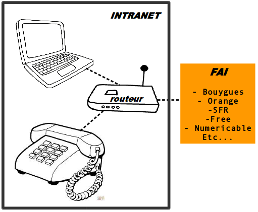
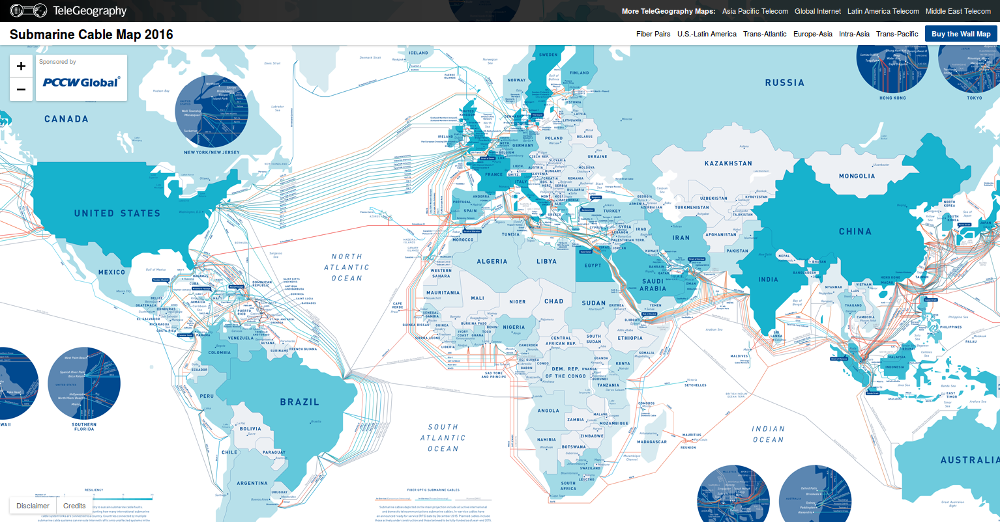

## Internet
Commençons par le commencement

### De quoi a-t-on besoin pour se connecter à l'Internet?

* un ordinateur (terminal)
* un téléphone (telephone)
* une box (**routeur**)
* et évidemment un abonnement à Internet! (**FAI**/prise tel)

avec un  **FAI** qui nous donne accès à Internet

Tout cela constitue notre **réseau domestique minimal** (HOME)

Notre FAI nous attribue une **adresse IP** unique externe ()

Evidemment on peut ajouter:
* un téléphone portable connecté en **WiFi**,
* une tablette,
* une imprimante,
* un ordinateur portable.

Notre BOX est équipée du WiFi  qui permet de connecter via la radio les différents terminaux d'accès à Internet.

Pour s'y retrouver, chaque **terminal** a une **adresse MAC** unique.

C'est notre **FAI** qui gargantit l'accès à l'Internet.
Regardons maintenant ce que se passe derrière la prise  internet soit à l'extérieur de notre réseau domestique.

Le FAI connecte votre box via la prise Internet à un **serveur** au bout de la rue ce serveur est connecté à d'autres serveurs de l'arrondissement, de la ville, du pays et ainsi de suite. Il en existe des milliers répartis sur l'ensemble de la planète de manière décentralisé. (Point historique si nécessaire)

* Carte des datacenters (les fermes de serveurs) situés en Europe

Source: [http://www.datacenter9.com/datacenters/france]

Copyright: datacenter9 2016

* Carte des câbles sous marins qui relient les continents

Source: [http://submarine-cable-map-2016.telegeography.com/](http://submarine-cable-map-2016.telegeography.com/)

Copyright: Telegeography 2016

Internet, c'est un donc:
* un **ensemble de serveurs**
* connecté par des **câbles**
* qui utilise un même **protocole de communication**
la famille [TCP/IP]

Parce qu'avec tout ces serveurs comment on s'y retrouve?

Chaque **serveur** dispose d'une **adresse IP** publique et unique (un peu comme une adresse postale) et utilise un même **protocole** pour communiquer avec un autre serveur.

Ici nous sommes connecté au réseau de la Paillasse, nous utilisons notre ordinateur et le protocole TCP/IP pour récupérer les informations d'un autre ordinateur.

=> Quelle est notre adresse IP?

**TCP/IP** permet aux ordinateurs d'échanger plein d'informations
* des mails
* des heures et de dates
* de la video
* des images
* des données financières...
Plein de trucs dont:
* des pages web

Mais il échange toujours l'information de la même manière.

Mimons un peu ce que fait notre ordinateur quand on consulte une page web via un **navigateur**.

Reprenons notre schema en le simplifiant:
un ordinateur  relié à un autre ordinateur par un réseau de serveurs

* Ping (décrocher le téléphone Allo?) [http://ping.eu/]
* Whois (Allo c'est constance Qui est à l'appareil?)[http://ping.eu/ns-whois/]
* Résolution de DNS (Serveur/Annuaire)[http://ping.eu/nslookup/] (Je souhaite contacter YouTube/ Ne bougez pas je vous le passe)
* Traceroute (Je cherche à joindre 208.65.153.238)[http://en.dnstools.ch/visual-traceroute.html]
* Envoi de données Message
* Pong (Raccrocher)

Dans le détail, pour que ca aille plus vite et que ce soit sécurisé: le protocole l'information sous forme de tout petit paquets d'informations par des chemins différents. Chaque paquet contient:
* l'expéditeur
* le destinataire
* le message
* le numéro du paquet

Dans le cas d'un message sécurisé le message est crypté avec un mot de passe unique communiqué autrement par l'expéditeur et que seul le destinataire connaît.
Par exemple **PGP**
