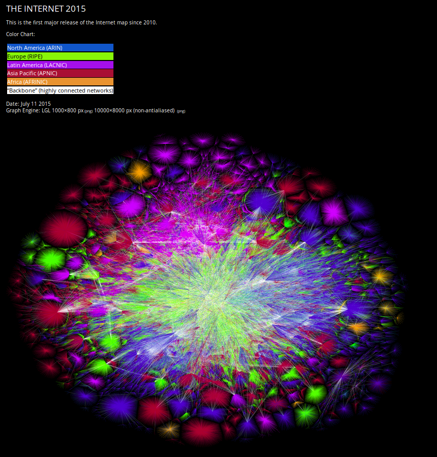

# Moteurs de recherche et données massives

* **Moteur de recherche ≠ World Wide Web**
* un **index** 📑 des ressources disponibles sur le web 🕸
* dans lequel on va chercher des ressources qui correspondent à une expression de recherche

## Collecte: le robot araignée

* Avant d'avoir une réponse il faut accumuler des ressources
* Pour cela, ils ont dressés des robots/araignées 🤖  **&#x1f577;** qu'on appelle **spider**

Ces spiders vont ainsi se promener sur la toile **🕸** de liens en liens et ainsi **crawler** le web:
  1. **collecter** les ressources pertinentes ☰
  2. **stocker** les informations contextuelles 💾
  3. **ranger, classer ordonner** ses ressources &#x1f453;

Sur le fonctionnement de cette araignée
une petite video de Matt Cuts qui date d'il y a bien 6 ans.

## Stockage, taille, classement
Le principe d'acquisition des données est assez simple en revanche on néglige souvent la masse d'information et les types de données qu'on stocke

Dernière estimation en date 2015: environ 4,65 milliard de pages web selon les chercheurs du OPTE PROJECT 
Norte utilisation d'internet consommerait l'équivalent de 40 centrales nucléaires, 2% de l'électricité mondiale soit l'équivalent de l'ensemble du traffic aérien.

Une ressource sur le web, un réseau social, un système expert, une bibliothèque. La manière dont on relie les données avec une information dépend de la philosophie du rangement

Entre la question et la réponse ce sont ses dépend énormément de ces données et évidemment de l'utilisation commerciale qu'on peut en tirer.

http://wikiverse.io/

## Classement, Pertinence et ciblage

* Quels critères de classement?
* A la une de Google
* Recette secrète pour deux raisons une bonne et une mauvaise

=> Est ce que vous avez des idées de base qui permet de distinguer une bonne d'une mauvaise information pour un moteur de recherche tel que Google, un réseau social tel que Facebook
##Le système publicitaire et l'économie de l'attention

## Traitement de la requete, ciblage algorithmes

https://labs.rs/en/quantified-lives/
